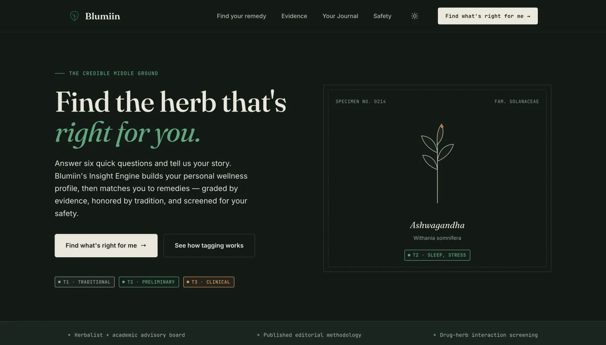
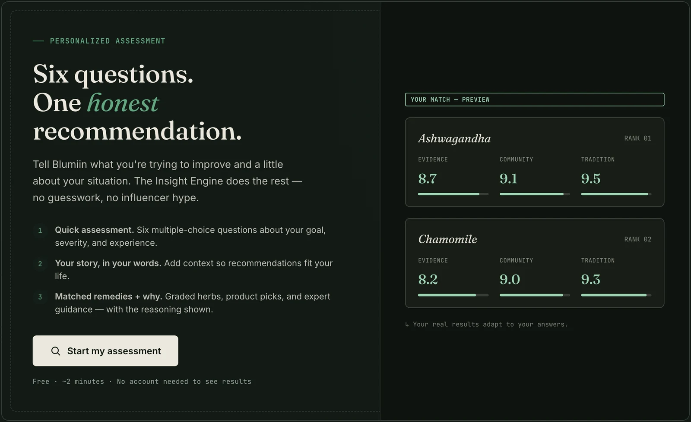

# Blumiin — "Find What's Right For Me"

A single-page herbal-discovery site with an interactive, AI-personalized wellness assessment.

## Screenshots



*Blumiin, the live page.*



*The six-question assessment.*

## Files

```
index.html        ← the entire app: markup, styles, wizard logic, herb database (one file)
api/insight.js    ← serverless function that calls Groq and keeps the API key secret
README.md         ← this file
```

The app is a single self-contained `index.html`. The only extra file is `api/insight.js`,
which is **required**: the Groq API key must live on the server, never in the browser. The
wizard still works without it (it falls back to a locally generated profile), but the
personalized AI narrative needs the function.

## How the AI personalization works

1. The user answers 6 questions + an optional free-text message in the browser.
2. The browser POSTs those answers to `/api/insight`.
3. The function calls Groq server-side using `GROQ_API_KEY` and returns a JSON profile
   (narrative, secondary concern, safety note, per-herb reasons).
4. If the function or Groq is unavailable, the browser silently uses a built-in fallback,
   so results always render.

Herb recommendations and evidence/community/tradition scores are deterministic (from the
curated database in `index.html`) — the AI personalizes the *wording*, not the medical content.

## Deploy to Vercel

1. Push this folder to a GitHub repo (or use `vercel` CLI / drag-and-drop import).
2. In Vercel: **New Project → import the repo**. No build command or framework needed
   (it's a static site + serverless function — zero config).
3. **Settings → Environment Variables**, add:
   - `GROQ_API_KEY` = your Groq key  *(required)*
   - `GROQ_MODEL` = `llama-3.3-70b-versatile`  *(optional; this is the default)*
4. Deploy. Visit the URL and click **"Find what's right for me."**

### Local preview
```bash
npm i -g vercel
vercel dev          # serves index.html + /api/insight locally
# set GROQ_API_KEY in your shell or a .env file first
```

## ⚠️ Security

- **Rotate your Groq key.** The key shared during setup should be regenerated in the Groq
  console, since it was transmitted in plain text. Put the new key only in Vercel's
  Environment Variables — never in `index.html` or committed code.
- The serverless function is what keeps the key off the client. Do not move the Groq call
  into the browser.

## Medical note

Blumiin presents educational information, not medical advice. The UI surfaces interaction
flags and "consult a professional" prompts by design — keep them.
